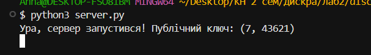
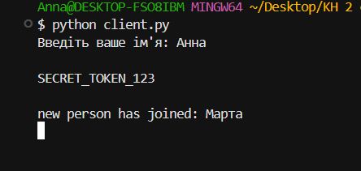
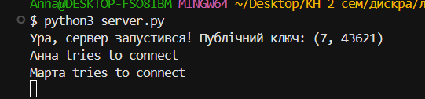
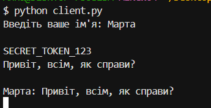
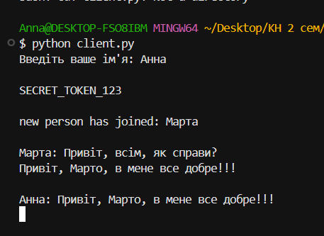
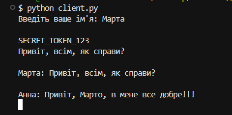

## Інструкції до запуску
1.  Старт сервера:
    ```bash
    python server.py
    ```
    
    Ви побачите публічний ключ сервера — це знак, що він готовий до рбооти.
    
    
3.  Запуск клієнтів:
    Треба відкрити 2-3 термінали (це будуть різні люди) і в кожному:
    ```bash
    python client.py
    ```
    
    
    Треба ввести різні імена (наприклад, Marta та Anna)
    Ви побачите секретне повідомлення від сервера і також в процесі буде інформація про те, що хтось приєднався.
    
     
    
    Все - можна писати щось і натискати enter, повідомлення з'являться в інших коритсувачів, ну і в вас, якщо вам хтось напише. Все надійно захищено з допомогою дискретної математики😉
    







P.S
* Чому `split('|')`? Я вирішила використовувати вертикальну риску як роздільник пакету даних. Перша частина — це підпис (хеш), друга — вантаж (текст). Це просто і легко парситься.
* Чому `map(int, ...)`? RSA працює з великими числами, а ми передаємо текст. Тому я конвертую кожну зашифровану літеру в число, збираю в рядок через кому, а на іншому боці розбираю назад.

## Implementation Details
Проєкт розділений на три логічні частини(відповідні файли): один для роботи сервера, інший для клієнтської обробки і головний(additions.py) - там логіка rsa + хешування.

### 1. Математична база
Тут я реалізувала класичний RSA, як це було описано в лекціях.
* Генерація ключів: програма шукає прості числа в діапазоні від 100 до 300. Це невеликі числа для справжнього зламу, але ідеальні для візуалізації роботи алгоритму. Саиі прості числа я обираю за принципом перебору дільників до кореня(ми так робили на семінарі)
* e = 65537: Я вибрала це число для експоненти, бо воно стандартне в криптографії(як я дізналась пошукавши). Але на всякий випадок є ще цикл, який робить перевірку і за потреби шукає інший e.
* Хешування: для перевірки цілісності я використала SHA-256. Кожне повідомлення супроводжується своїм унікальним 'кодом'. Якщо в зашифрованому повідомленні змінити хоча б одну цифру, при розшифруванні вийде щось інше, хеш не збіжиться з оригіналом.

### 2. Логіка сервера (`server.py`)
Не описуючи те, що нам вже було дано, моя додана реалізація працює так:
1. Сервер запускається(є вивід повідомлення про це) і загалом він чекає на користувача. Коли той з'явився, сервер записує його нік і публічний ключ, сам надсилає свій ключ і зашифрофує фразу secret_token = "SECRET_TOKEN_123", щоб клієнт впевнився в правильності сервера. 
2. Якщо сервер хоче надіслати всім повідомлення то він його шифрує ключем клієнта(в кожного свій звісно!!), і відсилає з хешем в стандартній формі, яку я обрала для передавання даних: `f"{h}|{encrypted_str}".encode())`(тому потім треба розділяти по | і перетворення певні робити)
3. handle_client() - це основний робочий цикл для кожного окремого клієнта:
* Отримання: чекає на пакет даних у форматі хеш | зашифровані_числа.
* Розшифрування: сервер використовує свій приватний ключ, щоб перетворити числа назад у текст.
* Перевірка цілісності: сервер рахує хеш від того, що розшифрував, і порівнює з присланим хешем (h_recv). Якщо вони однакові — повідомлення не було змінене хакерами😫
* Пересилка: сервер додає ім'я автора до тексту і викликає broadcast, щоб розіслати це повідомлення всім іншим.

### 3. Клієнтський інтерфейс (`client.py`)
Чат працює в реальному часі і приймає щось, і відсилає.
Логіка тут у трох функціях: 
* перша init_connection() - обмінюється ключами з сервером
* друга і третя read_handler(), write_handler() - працюють просто. Клієнт щось отримує - розкодовує, перевіряє хеш і має готове повідомлення, або коли треба послати - стврює унікальний хеш, кодує повідмлення і шле його. 
